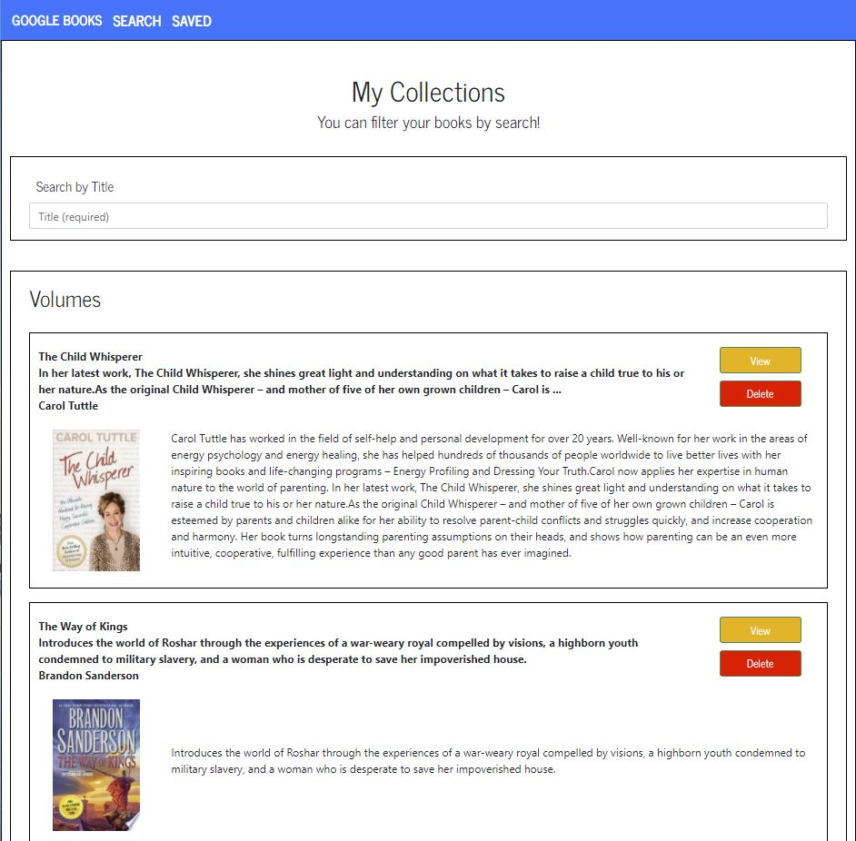

# iLib
[iLib](https://frozen-castle-25000.herokuapp.com/)

- A simple app to explore new reading material, save it for later, filter for specific title or author, and delete it when finished. 

# Viewed Here:
- [Heroku](https://frozen-castle-25000.herokuapp.com/)
- [github](https://github.com/JoeDonMalone/iLib)

## Description
- The goal was to implement a fully functional and user friendly MERN application which utilized the below technologies. It is a simple application, but displays competencies with back-end and front-end development. 

## Technologies:
  *  REACT
  *  axios
  *  bootstrap
  *  express
  *  mongoose

## Usage
 - Functional for the 'Volumes' of the Google Books API. I will perhaps imlement a feature that add directly to specific users 'google bookshelf' and create their own database, but it will be some time in the future. 
## Credits
 - [Google Books](https://developers.google.com/books)
## License
 - Licensed under the [MIT](./Assets/license.txt) license.
## Badges
 - NA

## Tests
 - None
